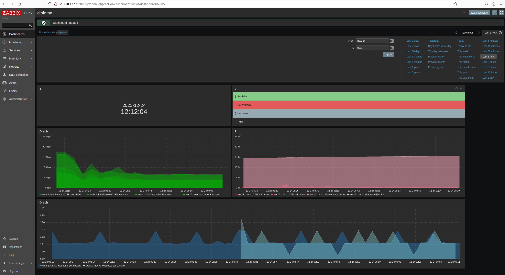
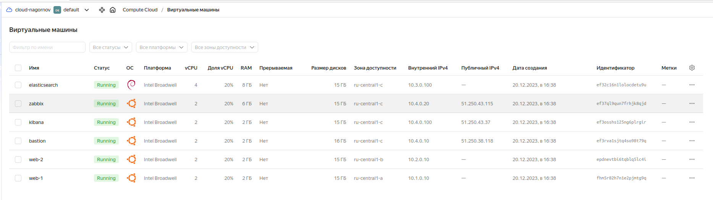
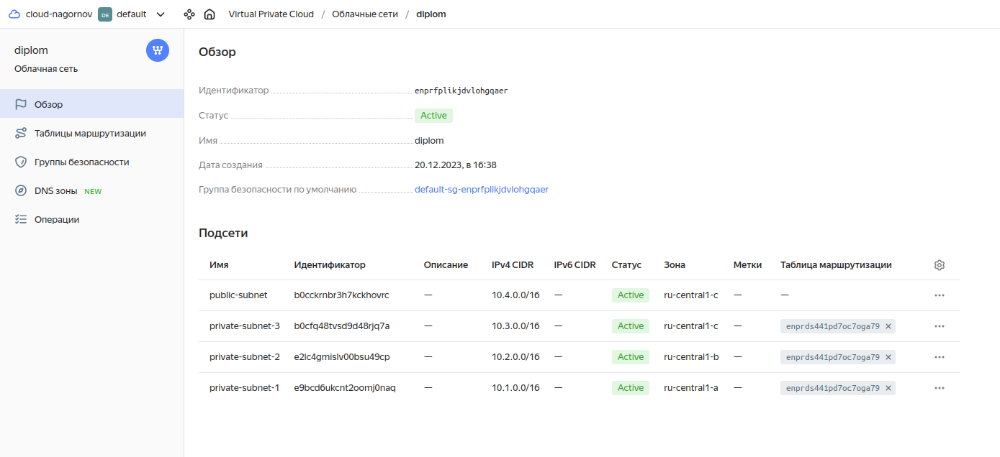
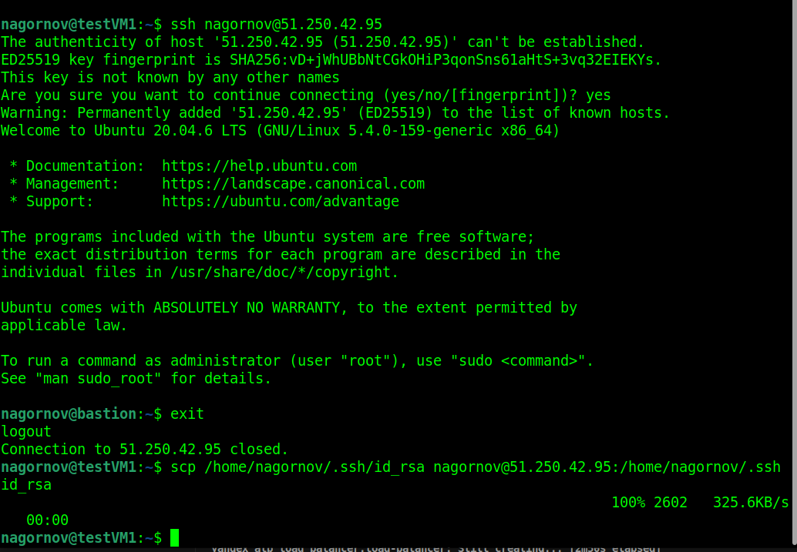
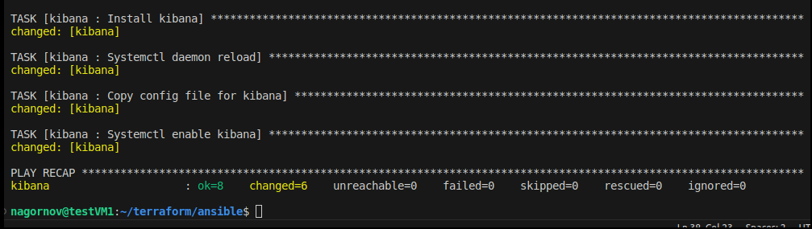
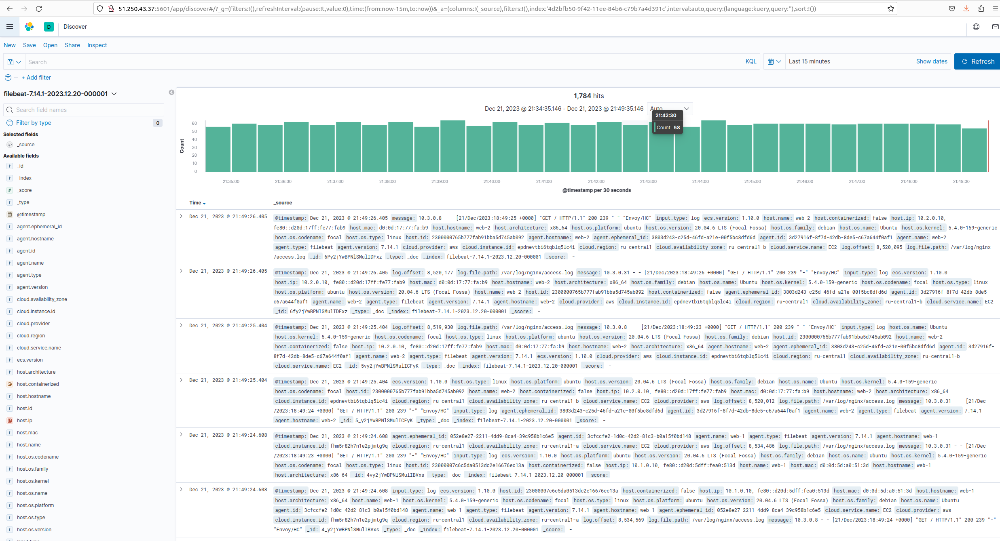
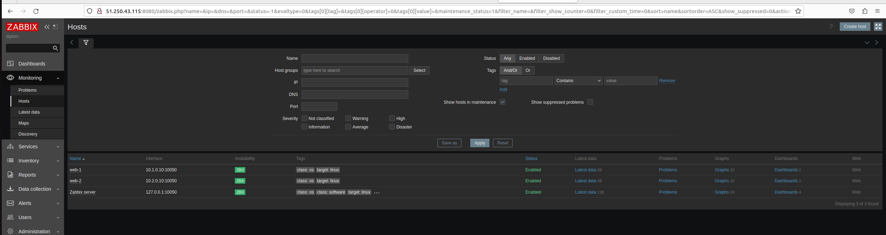

# Дипломная работа "Системный администратор Linux" - `Нагорнов Антон Алексеевич`

Работа над замечаниями:  

1.Файл host поправлен. Теперь используются fqdn имена.  
2.С ключом разобрался, оказалось, что в итоге копировал не тот ключ...  
3.Доступ к Zabbix по ссылке: http://51.250.43.115:8080 Логин Admin, пароль: zabbix  
4.ELK доступен по сслылке: http://51.250.43.37:5601  
5.Дэшборд nginx добавил:

*******************************************  
*******************************************
*******************************************

Создание инфраструктуры с помощью Terraform

Созданные виртуальные машины

Сети

Security group

Target group

Backend group

Loadbalancer

Router

Snapshot

Копирую в ручную приватный ключ для доступа к остальным хостам, так как не получилось это реализовать через terraform (пробовал прописывать в {metadata} и в meta.txt путь до ключа и сам ключ однако terraform никоим образом их туда не копирует.  
После копирования ключей и соединения по ssh, реализована концепция хоста Bastion. Все дальнейшие действия производятся через него.  

Далее используя Ansible устанавливаю сервисы:  
Для плейбуков Filebeat и Elastic дистрибутивы были предзагружены, так как наблюдались проблемы с доступом к их репозиториям. В плейбуках Zabbix-server и Kibana дистрибутивы загружались из репозиториев. 

Установка nginx

Сайт доступен по ссылке: http://158.160.136.169

Установка стека ELK для логирования:  

Установка Elastic

Установка Filebeat

Установка Kibana

Kibana доступна по сслылке: http://51.250.43.37:5601

Далее установка Zabbix для обеспечения мониторинга: 
Установка Zabbix-server 

Установка Zabbix-agent

Подключил хосты к Zabbix-server, проверил доступность

Настроил dashboard согласно заданию, Zabbix доступен по ссылке:  
http://51.250.43.115:8080

На этом всё, спасибо за обучение!

